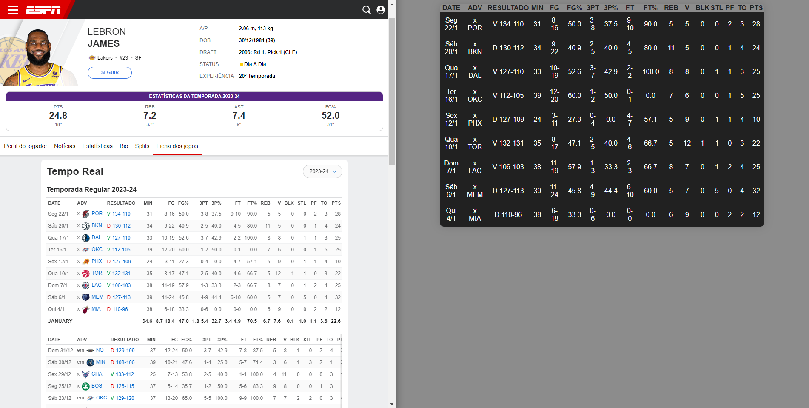

# NBA Master Stats

O NBA Master Stats é um programa de webscraping desenvolvido para coletar estatísticas de jogadores da NBA. Utiliza como fonte principal o site da ESPN.

## Tecnologias Utilizadas

- **Python**: Linguagem de programação usada para o back end.
- **Selenium**: Ferramenta utilizada para o webscraping.
- **Flask**: Framework usado para gerenciar as conexões.
- **HTML/CSS**: Usados para o design da página.

## Pré-requisitos

Antes de executar o programa, certifique-se de ter os seguintes softwares instalados em seu computador:

- Python
- Selenium
- Flask

Para realizar a instalação do Python clique [aqui](https://www.python.org/).

Você pode instalar o Selenium e Flask usando pip, o gerenciador de pacotes do Python. Aqui estão os comandos que você precisa executar no terminal:

pip install selenium
pip install flask

## Funcionalidades

O foco principal do programa está no back end. Atualmente, o programa é capaz de coletar várias estatísticas dos jogadores. No futuro, planejo adicionar funções para calcular a média de pontos, rebotes e assistências dos jogos escolhidos pelo usuário.

## Contribuições

Contribuições são sempre bem-vindas. Sinta-se à vontade para abrir uma issue ou enviar um pull request.

## Prints

* Página Inicial
  

* Estatísticas
  
